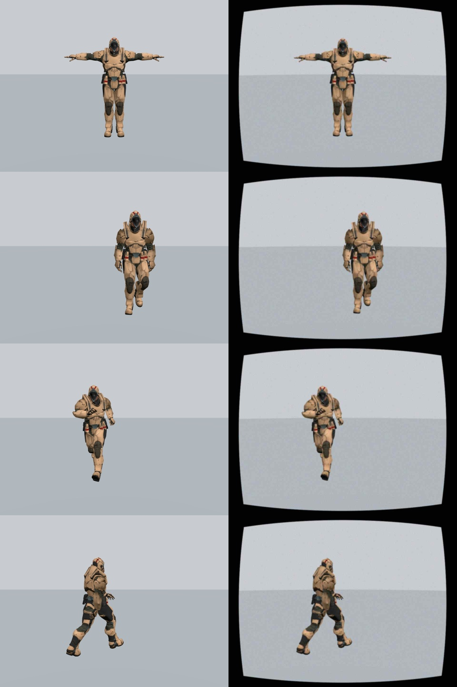

# Imperfect-camera hardening - 16 September 2026

Implemented protections improve fault handling; they do not establish reliable
everyday tracking. The clean rendered-human fixture still reaches only 80.4%
reliable joint coverage against a 90% target.

## Changes

- Measured per-camera focal lengths, principal point and five Brown distortion
  coefficients are saved in profiles. Existing profiles retain estimated lenses.
- Fusion corrects image landmarks before calibration/triangulation. Correction
  supports native image rotations of 0/90/180/270 degrees and uniform resizing.
  An aspect-ratio change pauses tracking instead of silently using the wrong lens.
- Camera layout provides **Import lens** and **Clear lens**. Changes remain local
  to the dialog until Apply; saved profiles and corner placement preserve them.
- A camera-pair consistency guard checks at least six mutually confident body
  joints against the saved camera geometry. Median epipolar discrepancy above
  20 pixels (normalized to 960-pixel width) is suspicious. A third camera is
  excluded when the other pair agrees within 10 pixels and both pairs involving
  that camera disagree. Ambiguous multi-pair disagreement pauses output.
- Persistent faults require at least eight distinct capture sets over 0.75 s
  before exclusion is latched. Reused captures do not accumulate evidence.
  Recalibrate clears the latch. Immediate exclusions/pauses can occur sooner.
- The app reports the reason in its activity log/debug status. A geometry fault
  clears the last VRChat frame, so the ordinary 350 ms occlusion hold cannot
  resend stale output during that fault.

The guard detects inconsistency, not its cause. It cannot distinguish every
camera movement from lens error, timing error or incorrect body landmarks.
Some movements are poorly observable; it does not automatically recover camera
positions or replace physical camera calibration.

## Fault-injection results

These use cached production DWPose detections, with deliberate geometric changes
to isolate fusion behavior. They are not new detector runs on moved-camera images.

| Three-camera case | Confident mean / p95 | Reliable joint coverage | Guard behavior |
| --- | --- | --- | --- |
| Unchanged fixture | 5.44 / 11.11 cm | 80.4% | No warnings or pauses |
| Third camera pitched 8 degrees during running | 5.57 / 11.47 cm | 72.9% | Exclusions and pauses; no persistent latch in this moving fixture |
| Third camera configured as 80-degree FOV instead of 60 | 5.67 / 11.66 cm | 77.7% | Third camera excluded and latched |

With two cameras and an 8-degree pitch change in the second camera, confident
motion output disappeared after the change. The guard paused some updates;
fusion rejected the remaining bad geometry. It did not reconstruct a dependable
pose from one remaining camera. Low-confidence points are not counted as reliable.

Artificial distortion followed by its known inverse recovered the clean fixture
metrics. Uncorrected distortion slightly improved some numbers in this particular
centered-character fixture; that is not evidence that wrong optics are helpful.
Detector/body-model errors dominate here and may partially cancel geometric errors.

## Actual degraded-image inference

The third camera's full 480-frame stream was warped with lens distortion
`[-0.3, 0.08, 0.002, -0.001, 0]`, blurred (5x5, sigma 1.2), given noise with
standard deviation 5/255, and JPEG-compressed at quality 35. Actual production
DWPose + Full inference ran on every altered frame. Other cameras remained clean.

| Lens handling | Confident mean / p95 | Reliable joint coverage |
| --- | --- | --- |
| Estimated lens | 5.43 / 10.85 cm | 79.1% |
| Known measured lens supplied | 5.48 / 11.13 cm | 79.0% |

Neither case triggered a geometry pause, and neither reached 90% coverage. This
shows tolerance to this particular single degraded source; it does not validate
three poor cameras, rolling shutter, real lighting, dynamic autofocus/stabilization
or physical/network/headset latency.



## Calibration and regression checks

Full verification passed **167 Python tests in 37.82 seconds**, compilation,
dependency checks, diagnostics, both browser suites and earlier defect reproductions.

- Known distorted rays recover to less than 0.002 pixels error across all four
  rotations and full/half resolution; changed aspect ratio pauses the fusion path.
- Calibration rejects insufficient/repeated views and invalid parameters. Training
  RMS must be <=1.5 pixels and every held-out view RMS <=2 pixels.
- A separate end-to-end run detected 24 rendered checkerboards, trained on 18 and
  validated six. Known focal lengths 820/825 pixels were recovered as
  821.34/826.23; held-out RMS ranged 0.057-0.154 pixels.
- Profile roundtrip and corner edits preserve calibration. A native GUI test imports
  JSON and verifies that Apply commits it without prematurely changing the profile.
- Guard tests cover consistent views, moved third camera, two-camera disagreement,
  stale-capture reuse, quarantine and loss of the remaining trusted pair.
- A running-controller regression verifies that a geometry fault stops sends after
  a valid tracker frame, without resending its stale position.

Raw evidence: [geometry faults](geometry-stress.json),
[degraded-image inference](image-stress.json),
[checkerboard workflow](lens-workflow-result.json).

Reproduce with the saved rendered fixture and DWPose cache:

```powershell
.venv\Scripts\python.exe scripts/simulation/stress_geometry.py
.venv\Scripts\python.exe scripts/simulation/stress_images.py
.venv\Scripts\python.exe scripts/simulation/check_lens_workflow.py
.venv\Scripts\python.exe scripts/verify.py
```
