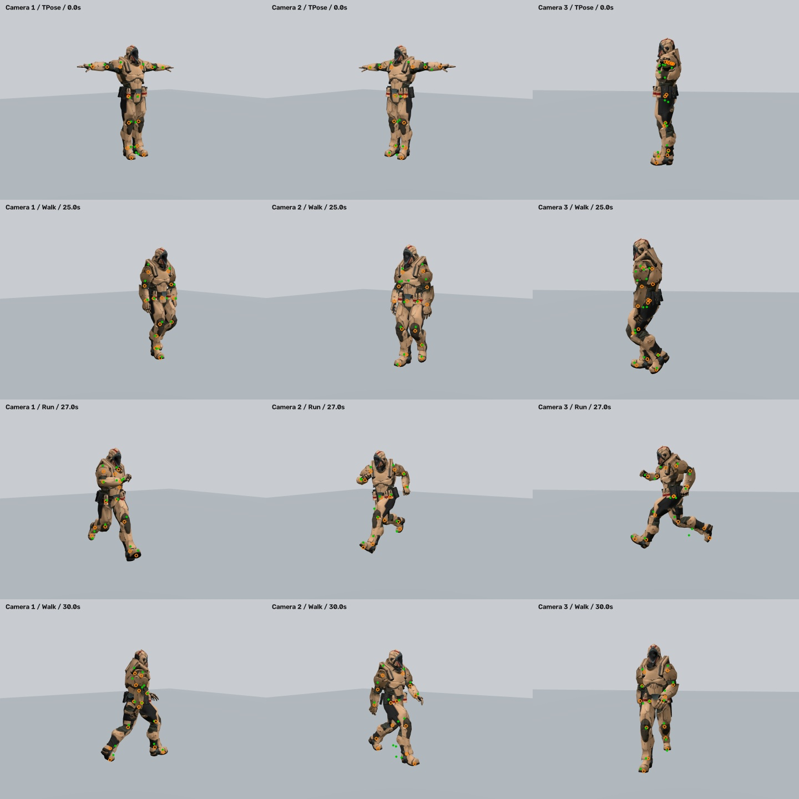
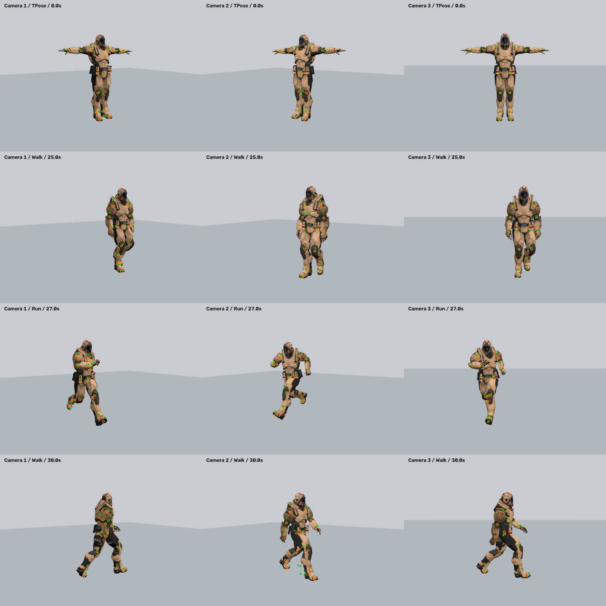
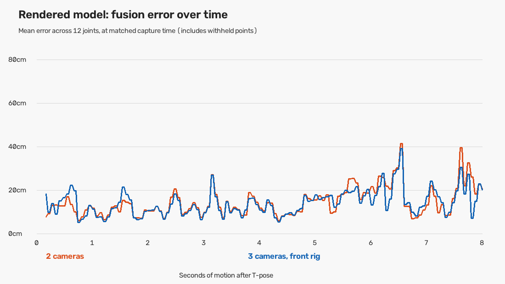

# Rendered multi-camera acceptance experiment

The current tracker does **not** pass the rendered-human acceptance test. Successful camera detection and exact-joint geometry tests are insufficient to establish usable full-body tracking.

## Normal-delay results

| Rig | Input path | Cameras | Calibration finished | Mean eligible-joint error | p95 error | Reliable joints within 20 cm | Pass |
| --- | --- | ---: | --- | ---: | ---: | ---: | --- |
| Side third camera | exact_joints | 2 | 10.13 s | 0.0 cm | 0.0 cm | 100.0% | True |
| Side third camera | exact_joints | 3 | 10.13 s | 0.0 cm | 0.0 cm | 100.0% | True |
| Side third camera | rendered_detector | 2 | 13.87 s | 13.9 cm | 48.1 cm | 73.8% | False |
| Side third camera | rendered_detector | 3 | No | — | — | 0.0% | False |
| Side third camera | rendered_known_geometry | 2 | Bypassed for diagnosis | 11.1 cm | 42.2 cm | 78.7% | False |
| Side third camera | rendered_known_geometry | 3 | Bypassed for diagnosis | 9.6 cm | 37.7 cm | 79.9% | False |
| Front third camera | exact_joints | 3 | 10.13 s | 0.0 cm | 0.0 cm | 100.0% | True |
| Front third camera | rendered_detector | 3 | 14.07 s | 13.2 cm | 48.8 cm | 72.8% | False |
| Front third camera | rendered_known_geometry | 3 | Bypassed for diagnosis | 9.9 cm | 34.9 cm | 79.0% | False |

## Method and limits

- 1,440 original rendered views plus 480 alternative third-camera views. Three virtual pinhole cameras, 960×720, 60° horizontal FOV, 15 FPS. 24 seconds in T-pose, then eight seconds walking, running and turning 180°. The two unchanged camera streams are reused for the alternative rig.
- Textured, skinned Soldier model rendered in Three.js/Chromium; actual Full MediaPipe pose inference on every original image and each new third-camera image. Camera geometry and animation joint centers provide independent ground truth.
- Production FrameSynchronizer and MultiCameraPoseFusion run at a simulated 30 updates/second, with the real ten-second calibration gate. The separate `rendered_known_geometry` diagnostic deliberately bypasses that gate using exact virtual camera geometry; it is **not** evidence that the normal application calibrated.
- Exact-joint input isolates geometry and timing. Camera completion delays are 10/80/40 ms; jitter adds 0–50 ms, dropout removes camera 2 for two seconds of running, and late adds 180 ms to camera 2 during motion. `arrival_only` deliberately discards true timestamps to demonstrate the remaining risk of unknown constant delays.
- Inference runs offline. Synthetic completion delays do not claim measured live throughput. There is no physical camera, WebRTC/network stack, final VRChat solver, OSC receiver, headset or avatar in this experiment.
- Error uses 12 shoulder/elbow/wrist/hip/knee/ankle centers against the animation rig at the selected capture time. Rig bones approximate anatomical landmarks. No post-hoc alignment or scale fit to the answer is used. `live_time_error_m` separately measures against the current simulated time, including the alignment delay.
- Acceptance was set before results: at least 90% of evaluated motion-phase joints must have confidence ≥0.5 and lie within 20 cm; p95 error of eligible joints must be ≤20 cm. This is a diagnostic threshold, not a VRChat product standard.
- One armored synthetic character in a simple environment cannot establish accuracy for real people, different clothing, lighting, avatars or camera optics. Failures here nevertheless disprove an unconditional readiness claim.

## Findings and fixes

1. The original fixed 100 ms timing buffer could prevent calibration under completion jitter. It now adapts within 100–200 ms while keeping the 33 ms view-separation limit. Exact-joint two/three-camera jitter tests now pass.
2. Two-camera dropout originally reused an old body translation with high confidence, reaching about 46 cm error in the exact-joint fixture. Fallback points without a current body transform are now below the output-confidence threshold. This pauses reliable output; it does not restore missing geometry.
3. The side-on third camera sees the near side but assigns low confidence to hidden limbs. The current requirement for a full T-pose in every selected view prevents calibration in that layout.
4. Rendered-image fusion still has large outliers even with exact camera geometry. Further work must address landmark confidence/occlusion, calibration observability and geometric outlier rejection. Passing unit tests is not a substitute for this acceptance result.

## Visual evidence

[Watch the rendered-camera clip](rendered-cameras.mp4). It contains the first second of T-pose and the eight-second motion phase; the remaining stationary calibration period is omitted from this preview.

Orange rings mark animation-rig joint centers; green dots mark detected image landmarks. These contact sheets show detector output, not reconstructed 3D accuracy.







Full numerical evidence: [side rig](results.json), [front rig](front/results.json). The earlier [baseline](baseline-results.json) used a shorter 12-second T-pose and is retained as failure evidence, not an identical-duration accuracy comparison.

## Reproduce

From the repository root:

```powershell
npm install --prefix scripts/simulation --ignore-scripts --no-audit --no-fund
New-Item -ItemType Directory -Force review/simulation/assets | Out-Null
Invoke-WebRequest 'https://raw.githubusercontent.com/mrdoob/three.js/r180/examples/models/gltf/Soldier.glb' -OutFile review/simulation/assets/Soldier.glb
$env:SIM_RIG = 'side'
node scripts/simulation/render.cjs 480
.venv\Scripts\python.exe scripts/simulation/evaluate.py --refresh
$env:SIM_RIG = 'front'
node scripts/simulation/render.cjs 480
.venv\Scripts\python.exe scripts/simulation/evaluate.py --front --refresh
.venv\Scripts\python.exe scripts/simulation/report.py
```

The renderer uses installed Chrome on Windows; set CHROME_PATH for another Chromium executable. Frames and detector caches are ignored by Git. The application dependency environment is unchanged.

Asset source: [three.js r180 Soldier.glb](https://github.com/mrdoob/three.js/blob/r180/examples/models/gltf/Soldier.glb). Rendering code dependencies are pinned in scripts/simulation/package-lock.json.
Model SHA-256: `dfb230fc1f942f259dd00281a1186953ad602fc5d69067ce63e24b2aa439736b`.
